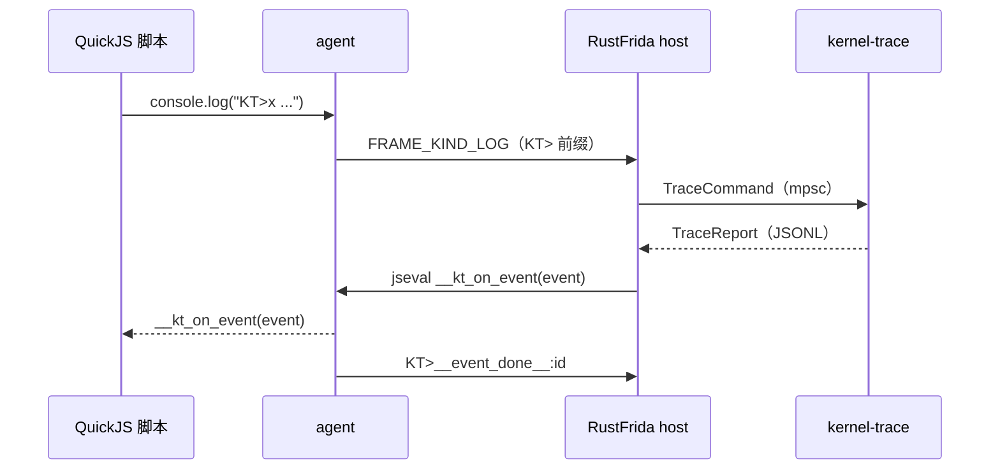
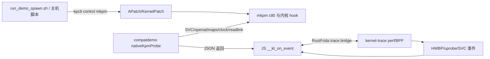

# rustFrida 使用与兼容性手册

这份文档是日常使用的唯一入口。它说明如何构建、如何在自有 Android 开发机上运行
兼容性 demo、每个通道应该看到什么、出现错误时先查什么，以及 RustFrida、LSPosed
和 stackplz 的职责边界。

实现推导、tombstone 和历史压测仍保留在 `doc/`、`runs/` 和 `mkpms/`，它们是查证
材料，不是运行前置条件。所有实验都应限制在自己拥有的设备、应用和测试文件上。

## 先按目的选择

| 目的 | 直接运行 | 先看什么 |
| --- | --- | --- |
| 验证启动期 hook、`.init_array`、Java/Dex | `run_demo_spawn.sh 0` 或 `1,2` | `rf-output.log`、`SUMMARY.txt` |
| 改函数指针后立即 hook 新方法 | `run_demo_spawn.sh 5` | `hwbp.hit`、`method slot changed`、方法 hook 日志 |
| 看某条 native 指令和读写现场 | `run_demo_spawn.sh 5,6` | `trace-output.jsonl` 的 `pc/addr/regs/instruction` |
| 看 syscall 来源和参数 | `run_demo_spawn.sh 3` 或 `9` | `svc.enter`、`mkpm.log` |
| 对照 UID/路径视角变化 | `run_demo_spawn.sh 11,12,13,14,15` | App 日志与 root shell 对照文件 |
| 验证 CRC32/WXSHADOW 能力 | `run_demo_spawn.sh 10` | `mkpm-crc32` 日志和 dmesg；Pixel 6 失败要记为能力缺口 |

先用正常档单通道跑通，再组合通道，最后才使用 `EXTREME=1`。需要通信时直接跳到
[“适合的场景和通信闭环”](#适合的场景和通信闭环)；需要故障证据时跳到
[“错误排查”](#错误排查)。

## 一次准备

需要以下条件：

- macOS 主机，已安装 Android SDK/`adb`、Android NDK 25 或更高版本、Rust 和 Docker；
- ARM64 Android 开发机，已解锁并 root，`su` 可执行；
- 设备上的 APatch/KernelPatch 与 `kpctl`；
- RustFrida 仓库子模块已初始化：

```bash
cd /Users/freeman/project/douyin/rustFrida
git submodule update --init --recursive
```

Pixel 6/Android 14 使用 GKI 6.1 内核。Pixel 5 的 4.19 头文件和旧 `.kpm` 不能直接
拿来给 Pixel 6 使用；KPM 必须按目标设备的 `.kp` 内核头文件重新编译。RustFrida
二进制和 KPM 是两条独立的构建链，改了哪一部分就重建哪一部分。

## 构建 RustFrida 和 demo App

### RustFrida（主程序）

仓库的 Android 构建脚本默认使用 `rustfrida_target/`，不要把旧的 `target/` 目录中的
主程序和 agent 混用：

```bash
cd /Users/freeman/project/douyin/rustFrida
CARGO_TARGET_DIR="$PWD/rustfrida_target" bash .build-android.sh rust_frida
```

产物是：

```text
rustfrida_target/aarch64-linux-android/release/rustfrida
```

只改 JS 时不用重新编译 RustFrida，只需重新 `adb push` 脚本。若必须兼容旧脚本，
可以显式使用 `CARGO_TARGET_DIR=target`，但构建、推送和运行必须始终使用同一目录。

### 兼容性 demo APK

```bash
cd /Users/freeman/project/douyin/rustFrida
bash examples/rustfrida-compat-app/build_demo.sh
```

只改 Java/C 代码或 `payload-src/` 后需要重新构建 APK；只改
`examples/rustfrida-compat-app/test_compat_demo.js` 时不需要重新构建 APK。没有系统
`gradle` 时指定一个可用的 Gradle：

```bash
GRADLE_BIN=/path/to/gradle bash examples/rustfrida-compat-app/build_demo.sh
```

### mkpm.kpm（可选的内核模块）

compat demo 使用仓库内的合并产物：

```text
/Users/freeman/project/douyin/rustFrida/mkpms/dist/mkpm.kpm
```

推荐在 Docker 容器 `z-ws` 中，从 **rustFrida 仓库内的 `mkpms/`** 编译。下面命令会
同步当前源码，再只构建合并入口 `mkpm.kpm`：

```bash
cd /Users/freeman/project/douyin/rustFrida
tar -cf - -C mkpms CMakeLists.txt kernel kpms/mkpm kpms/hide-maps kpms/wxshadow kpms/common \
  | docker exec -i z-ws sh -c 'rm -rf /tmp/mkpms && mkdir -p /tmp/mkpms && tar xf - -C /tmp/mkpms'

docker exec z-ws sh -c '
  set -eu
  rm -rf /tmp/mkpms/build-mkpm
  mkdir -p /tmp/mkpms/build-mkpm
  cd /tmp/mkpms/build-mkpm
  cmake -DCMAKE_C_COMPILER=aarch64-linux-gnu-gcc -DCMAKE_BUILD_TYPE=Release ..
  make -j2 mkpm.kpm
'

mkdir -p mkpms/dist
docker cp z-ws:/tmp/mkpms/build-mkpm/kpms/mkpm/mkpm.kpm mkpms/dist/mkpm.kpm
```

构建时必须保留根 `mkpms/CMakeLists.txt` 中的 `-ffixed-x18`。Pixel 6 的 GKI 开启了
Shadow Call Stack，普通 GCC 若把 x18 当临时寄存器，KPM 可能在返回路径破坏内核栈。
构建后至少检查：

```bash
docker exec z-ws sh -c \
  'aarch64-linux-gnu-readelf -sW /tmp/mkpms/build-mkpm/kpms/mkpm/mkpm.kpm | grep UND'
docker exec z-ws sh -c \
  'aarch64-linux-gnu-readelf -sW /tmp/mkpms/build-mkpm/kpms/mkpm/mkpm.kpm | grep __kpm'
```

`UND` 中出现裸的 `memcpy`、`memset`、`snprintf` 等 libc 符号通常会导致加载失败；
入口符号应只有一组 `__kpm_initcall`、`__kpm_ctlmodule`、`__kpm_exitcall`。详细的
源码约束见 [`mkpms/kpms/mkpm/README.md`](mkpms/kpms/mkpm/README.md)。

### kpctl（设备控制工具）

runner 会优先使用设备上的 `/data/adb/ap/bin/kpctl`，找不到时自动从
`../dyidre/tools/kpctl/kpctl` 推送。需要自己重新编译时：

```bash
cd /Users/freeman/project/douyin/dyidre/tools/kpctl
make NDK=1 NDK_ROOT=/Users/freeman/Library/Android/sdk/ndk/25.2.9519653
adb push kpctl /data/local/tmp/kpctl
adb shell su -c 'chmod 755 /data/local/tmp/kpctl'
```

也可以设置 `ANDROID_NDK_HOME` 后只执行 `make NDK=1`。设备上的 `apkpm` wrapper 会
自动读取 `/data/adb/ap/superkey`；不要把 superkey 写入仓库或公开日志。runner 的
`KP_SUPERKEY` 仅用于本地实验。

## 唯一运行入口

先确保 `rustfrida_target/.../rustfrida`、APK 和（如果选择 8--15）
`mkpms/dist/mkpm.kpm` 已存在，然后执行：

```bash
cd /Users/freeman/project/douyin/rustFrida
bash examples/rustfrida-compat-app/run_demo_spawn.sh
```

脚本会显示菜单。也可以直接传一个编号、名称或逗号分隔的组合：

```bash
# RustFrida 全部通道
RUN_SECS=60 BUILD_RF=0 BUILD_APP=0 bash examples/rustfrida-compat-app/run_demo_spawn.sh 0

# C + Java
bash examples/rustfrida-compat-app/run_demo_spawn.sh 1,2

# JNI 注册观察 + GumTrace
bash examples/rustfrida-compat-app/run_demo_spawn.sh jnitrace,gumtrace

# KPM 的全部演示，或只运行一个小模块
bash examples/rustfrida-compat-app/run_demo_spawn.sh 8
bash examples/rustfrida-compat-app/run_demo_spawn.sh 13
```

### 菜单和效果

| 选择 | 通道 | 代码入口 | 生效标准 |
| --- | --- | --- | --- |
| `0` | `all` | 运行以下 1--7 | `SUMMARY.txt` 中各选中通道有事件或明确的启动记录 |
| `1` | `c` | `test_compat_demo.js` 的 `installNativeHook()` | `rf_agent_hot` 出现 enter/leave，返回值和参数可见 |
| `2` | `java` | `installJavaHooks()`、`DexProbe` | Java hook 命中，并出现动态 `DexPayload.run()` 日志 |
| `3` | `svc` | `native_demo.c` 的 raw SVC/`nativeSvcBurst()` | `trace-output.jsonl` 有 `svc.enter`；事件数大于 0 |
| `4` | `jnitrace` | `installJniTrace()`、`JniProbe` | 看到 `RegisterNatives` 注册的方法名、签名或地址 |
| `5` | `hwbp` | `armKernelTrace()` 的 `KT>x/r/w` | 有 `hwbp.hit`；寄存器、PC/LR，以及 `instructions` 中连续 16 条 ARM64 指令可解析 |
| `19` | `hwbp-rotate` | 命中 3 次后 `KT>bpdel`，切换下一个执行地址 | host 依次出现 `hwbp detached`、新的 `hwbp attached`；`SUMMARY.txt` 的 `hwbp_rotate_ok=1`，全线程覆盖看 `hwbp_rotate_coverage_full=1` |
| `6` | `uprobe` | `KT>brk libcompatdemo.so+...` | 有 `uprobe.hit`，且事件的模块/偏移正确 |
| `7` | `gumtrace` | `installGumTrace()` | `gumtrace-compatdemo.log` 出现 `GumTrace started` 和指令行 |
| `8` | `mkpm` | `kpctl control mkpm ...` | `status` 正常，随后各子项按自己的对照标准通过 |
| `9` | `mkpm-probe` | `syscall` + `nativeKpmProbe()` | `syscall read` 有事件，并能看到 `nr`、UID/TGID、计数和丢失数 |
| `10` | `mkpm-crc32` | `wxshadow enable/disable` + CRC32 | 先记录基线；支持时开启/关闭的 CRC 对照符合脚本 verdict |
| `11` | `mkpm-hide` | `hide enable/disable maps` | App 的 maps 对照随开关变化，关闭后恢复；shell 只作参照 |
| `12` | `mkpm-redirect` | `redirect <uid> addexact ...` | App 打开 marker 得到重定向内容，未匹配 shell 路径仍是原文件 |
| `13` | `mkpm-time` | `boot uid` + syscall 113 | App 的 `CLOCK_BOOTTIME` 与 root shell 相差约 600 秒 |
| `14` | `mkpm-inode` | `emaps <uid> addino ... 1` | App maps inode 与 root shell 同一 VMA 的 inode 不同 |
| `15` | `mkpm-readlink` | `antidetect name add ...` | App 对指定 symlink 返回 `-ENOENT`，root shell 仍看到原始目标 |

“事件数为 0”不等于框架一定失效：例如只启动了 Java 通道时，SVC 统计为 0 是正常
的。先看 `selected_modes`，再按上表检查该通道自己的判据。

### 运行器环境变量

| 变量 | 默认值 | 用途 |
| --- | --- | --- |
| `RUN_SECS` | `90` | 实验时长；先用 30--60 秒定位问题 |
| `BUILD_RF` | `0` | 设为 `1` 自动重建 RustFrida |
| `BUILD_APP` | `0` | 设为 `1` 自动重建 APK |
| `EXTREME` | `0` | 设为 `1` 提高压力；会增加事件丢失，不适合首次排查 |
| `LOW_FREQ` | `1` | 默认低频档；设为 `0` 使用普通频率。`EXTREME=1` 会自动覆盖为压力档 |
| `DEVICE_SERIAL` | 空 | 多设备时指定 adb serial |
| `RF_BIN` | `rustfrida_target/.../rustfrida` | 使用指定主程序 |
| `KPM_FILE` | `mkpms/dist/mkpm.kpm` | 使用指定 KPM |
| `KPCTL_HOST` | `../dyidre/tools/kpctl/kpctl` | 本机 kpctl；脚本会自动 push |
| `KP_SUPERKEY` | `amigo123` | APatch/KernelPatch superkey |
| `KPM_RELOAD` | `0` | 设为 `1` 执行受控卸载再加载 |
| `RF_TRACE_LIVE` | `svc,hwbp,uprobe` | 实时摘要通道，可设为空减少终端噪音 |
| `RF_TRACE_LIVE_EVERY` | 低频为 `1`，普通/压力为 `100` | 每类事件每多少条打印一次样本 |

首次排查建议：

```bash
RUN_SECS=30 LOW_FREQ=1 EXTREME=0 RF_TRACE_LIVE=svc,hwbp,uprobe RF_TRACE_LIVE_EVERY=1 \
  bash examples/rustfrida-compat-app/run_demo_spawn.sh 1,2,3,4,5,6,7
```

确认链路后再开启 `EXTREME=1`。高压力下应以 JSONL 中的丢失计数评估采集能力，不能
把“终端只显示少量样本”误认为只有少量事件。

## 输出在哪里，怎样判断实时性

每轮输出在：

```text
runs/compat-demo/<时间戳>/
```

- `rf-output.log`：RustFrida、JS 和运行器的实时合并输出；
- `trace-output.jsonl`：完整的 SVC/uprobe/HWBP 事件流；不存在时表示该轮没有启用 KT；
- `gumtrace-compatdemo.log`：GumTrace 文件输出；
- `SUMMARY.txt`：退出码、选中模式和事件计数；
- `logcat.txt`：本轮结束时拉取的设备 logcat，可能包含此前历史记录；
- KPM 轮次还会有 `mkpm.log`、`probe-sysmon.log`、`boot-time.log` 等对照文件。

运行器使用 `tee`，因此 `rf-output.log` 是边跑边写的；终端显示的是节流后的摘要。
例如 `trace-output` 的队列统计每约 5 秒输出一次，`RF_TRACE_LIVE_EVERY=1` 只影响事件
样本频率，不会关闭 JSONL。`ring丢弃`、`队列丢弃` 大于 0 表示发生背压，需降低压力
或缩小观察范围；它不是断点实现本身的命中数。

## spawn、attach 和 hybrid

### spawn（启动期注入）

spawn 能覆盖 `Application.onCreate()`、`.init_array`、早期 ClassLoader 和启动期 native
代码，是兼容性 demo 的默认方式。非交互运行必须保持 stdin 打开，否则 REPL 收到 EOF
会主动退出，常见表现是只看到 `script loaded`：

```bash
adb shell su -c '(sleep 60; echo exit) | timeout 65 \
  /data/local/tmp/rustfrida --spawn com.example.app \
  -l /data/local/tmp/script.js'
```

`run_demo_spawn.sh` 已经内置了这段保活逻辑，不需要每次手写 adb shell。Java worker
启动后才调用 Java API；如果只看到脚本加载而没有 Java 日志，可在提示符中执行：

```text
%reload /data/local/tmp/script.js
```

结构体方法槽实验有一个 500 ms 的 native gate：native 写函数指针后等待 HWBP 事件，
JS 读取新地址并安装一次 hook 后调用 `nativeMethodHookReady()` 放行。事件队列有延迟
时会增加等待，但超时会自动放行，不会把进程永久锁住；若要保证切换期间一定先 hook，
应降低压力并观察 `method_slot`、`hwbp.hit` 和 `nativeMethodHookReady` 是否成对出现。

### attach（已运行进程）

```bash
adb push examples/templates/01_native_hook.js /data/local/tmp/
adb shell su -c \
  '/data/local/tmp/rustfrida --name com.example.app -l /data/local/tmp/01_native_hook.js'
```

attach 适合已经知道模块已加载、只观察稳定函数的场景；它无法补回注入前已经发生的
`.init_array` 或早期 Java 行为。

### hybrid（agent + kernel-trace）

只有 `--mode=hybrid` 才会消费 `KT>` 命令：

```bash
adb shell su -c '(sleep 60; echo exit) | timeout 65 \
  /data/local/tmp/rustfrida --spawn com.example.app --mode=hybrid \
  -l /data/local/tmp/03_kernel_trace.js \
  --trace-lib libcompatdemo.so --trace-lib-only --trace-decode-args \
  --trace-output /data/local/tmp/trace.jsonl'
```

`--trace-disable-syscall` 只关闭 SVC 采集；`--trace-lib`/`--trace-lib-only` 是 syscall
来源过滤，不会自动过滤 HWBP 或 uprobe。`--trace-decode-args` 只影响 syscall 参数
解码。一个 `hybrid` 实例对应一个 kernel-trace 实例，结束后先让 runner 清理，再启动
下一轮。

## JS 模板和 KT> 命令

可复用模板集中在 [`examples/templates/`](examples/templates/)：

| 文件 | 用途 |
| --- | --- |
| `01_native_hook.js` | native 导出函数 `Interceptor.attach` |
| `02_java_hook.js` | `Java.ready` + `Java.use` |
| `03_kernel_trace.js` | SVC、uprobe、HWBP 桥接 |
| `04_jni_trace.js` | `RegisterNatives` 注册表观察 |
| `05_memory_probe.js` | 内存读取和十六进制输出 |
| `06_agent_replace.js` | native 替换式 hook |
| `07_gumtrace.js` | GumTrace 指令级追踪 |
| `08_memory_dump.js` | 模块可读区分块转储和 `.map` |
| `09_file_io.js` | 文本/二进制文件读写 |
| `10_memory_rw.js` | `Memory.alloc`、指针和字节读写 |
| `11_backtrace.js` | ARM64 native 堆栈 |
| `12_method_call.js` | `NativeFunction` 和 Java 方法调用 |
| `13_kpm_control.js` | JS 通过 `libc.syscall(45)` 低频控制 `mkpm` |

模板是独立脚本，不需要 `import`。改目标模块、符号、偏移和签名后再推送。Java 调用
必须位于 `Java.ready(function () { ... })` 内；QuickJS 环境没有浏览器的
`setTimeout`/`setInterval`，不要用它们等待模块，使用 `dlopen` 回调或目标函数回调。
`readU64` 返回 `bigint`，不要直接和 JavaScript `number` 做位运算。

KT> 命令通过 `console.log` 发送：

| 命令 | 作用 |
| --- | --- |
| `KT>sub` / `KT>unsub` | 订阅/停止事件回调 |
| `KT>print` | 保留 host 终端输出 |
| `KT>brk libfoo.so 0x1234` | native 软件探针（uprobe） |
| `KT>x libfoo.so+0x1234` | 执行硬件断点 |
| `KT>r libfoo.so+0x5678 8` | 8 字节读观察点 |
| `KT>w libfoo.so+0x5678 8` | 8 字节写观察点 |
| `KT>rw libfoo.so+0x5678 8` | 读写观察点 |
| `KT>bpdel 0x...` | 删除对应地址的硬件断点 |

`globalThis.__kt_on_event` 是事件到达 JS 后的回调，不是断点现场发生时同步执行的
函数。HWBP 事件先经过内核事件源、ring、RustFrida 队列，再投递给 QuickJS；队列满或
过滤时可能丢失。因此需要“命中即阻塞”的场景，使用 demo 的 native gate 或降低事件
速率，不能只依赖异步回调。

HWBP 事件尽量包含 `pid`、`tid`、`comm`、`pc`、`lr`、`bp`、完整 ARM64 寄存器、PC
处 4 字节指令 word。host 文本会把能解析到模块的地址直接写成
`0x地址(模块.so+0x偏移)`；JSONL 保留原始地址，并在 `locations` 对象中记录相同的偏移，
不再输出分散的 `_off` 字段。已知指令会打印可读汇编，无法识别的编码保留为
`.word 0x...`；可把 PC 附近字节导出后用与目标版本匹配的 LLVM/Capstone 再确认。

## 适合的场景和通信闭环

### HWBP 命中后立即安装 JS hook

最适合的场景是“结构体/vtable 中的函数指针刚被改写，下一次调用就要观察”。不要等
到命中以后再把一整份新脚本从主机传进进程；spawn 时先加载一个很小的 dispatcher，
收到写观察点事件后在同一个 QuickJS 上下文中读取新指针并安装 hook：

```js
'use strict';

var Native = null;
var methodSlot = null;
var installed = Object.create(null);

function addrKey(value) {
    return String(ptr(value)).toLowerCase();
}

function installMethodFromSlot() {
    var target = methodSlot.readPointer();
    var key = addrKey(target);
    if (!installed[key]) {
        installed[key] = Interceptor.attach(target, {
            onEnter: function () {
                console.log('[method] target=' + target +
                    ' pc=' + this.pc + ' x0=' + this.x0 + ' x1=' + this.x1);
            }
        });
        console.log('[method] hook installed at ' + target);
    }
    // 放行 native writer 的 500 ms gate；必须在 try/finally 语义下保证调用。
    Native.nativeMethodHookReady();
}

globalThis.__kt_on_event = function (event) {
    if (!event || event.type !== 'hwbp.hit') return;
    if (!event.bp || event.bp.kind !== 'w') return;
    if (!methodSlot) return;
    if (addrKey(event.bp.addr) !== addrKey(methodSlot)) return;
    try {
        installMethodFromSlot();
    } catch (error) {
        console.log('[method] install failed: ' + (error.message || error));
        // 即使读取失败也必须放行，避免测试进程永久等待。
        try { Native.nativeMethodHookReady(); } catch (_) {}
    }
};

globalThis.__kt_on_ack = function (message) {
    console.log('[kt-ack] ' + message);
};

function armMethodSlot() {
    Native = Java.use('com.rustfrida.compatdemo.Native');
    var info = JSON.parse(String(Native.nativeInfo()));
    methodSlot = ptr(info.method_slot_addr); // 使用 nativeInfo 的运行时地址，适配 ASLR
    console.log('KT>sub');
    console.log('KT>w ' + methodSlot + ' 8');
}

Java.ready(armMethodSlot);
```

在 compat demo 上直接验证：把代码保存为 `/tmp/method_hwbp.js` 后推送，再运行单通道
HWBP；如果使用仓库自带实现，直接执行最后一条即可：

```bash
adb push /tmp/method_hwbp.js /data/local/tmp/method_hwbp.js
adb shell su -c '(sleep 30; echo exit) | timeout 35 \
  /data/local/tmp/rustfrida --spawn com.rustfrida.compatdemo --mode=hybrid \
  -l /data/local/tmp/method_hwbp.js --trace-output /data/local/tmp/method-hwbp.jsonl'

RUN_SECS=30 BUILD_RF=0 BUILD_APP=0 \
  bash examples/rustfrida-compat-app/run_demo_spawn.sh 5
```

compat demo 的实际实现位于 `test_compat_demo.js` 的
`resolveChangedMethodTarget()`：`nativeMethodSwitch()` 写槽位后等待，JS 收到
`hwbp.hit`，重新读取 `method_slot_addr`，按地址去重安装 `Interceptor.attach`，最后调用
`nativeMethodHookReady()`。这个顺序比“收到日志后再执行 `loadjs`”可靠，因为后者至少
多一次 host→agent 往返，而且重载脚本可能清除已有 hook。

事件回调仍是异步的：断点现场先进入 perf/BPF ring，再经过 Rust 队列和 QuickJS。当前
桥接器对回调采用有界准入，最多一个 JS 回调在途；SVC 约 200 次/秒，uprobe 与 HWBP
共用约 100 次/秒的非 SVC 预算，单个回调约 2 秒未完成会触发熔断。gate 只解决 demo
中“写入和下一次调用之间的时序”，不把异步事件变成内核级同步回调。要降低漏报：

1. 先 spawn，再发送 `KT>sub` 和 `KT>w`，不要在目标已经高频切换后才 attach；
2. 回调只做地址读取、去重和 hook 安装，不在回调中做大块 dump、文件 I/O 或 Java 重活；
3. 限定 PID/TID/目标地址，关闭 `EXTREME`，检查 `trace-output.jsonl` 的丢失计数；
4. 观察 `method_slot`、`hwbp.hit` 和 `nativeMethodHookReady` 是否一一对应。

### 执行断点、读写观察点和现场分析

需要看“哪条指令读/写了什么”时，先把三种点分开：

```js
console.log('KT>x libcompatdemo.so+0x1234'); // 指令执行点
console.log('KT>r ' + objectAddr + ' 8');     // 读观察点
console.log('KT>w ' + objectAddr + ' 8');     // 写观察点
```

回调中使用 `event.pc` 作为访问指令地址，`event.addr` 作为观察点访问地址，
`event.instruction.word/asm` 作为当前指令，`event.instructions` 作为从命中 PC 开始的
16 条连续 ARM64 指令窗口（每项带 `pc/word/bytes/asm`），`event.regs` 作为完整寄存器现场。
能解析到模块的偏移通过 `event.locations.pc`、`event.locations.lr`、
`event.locations.xN` 或 `event.locations.addr` 获取。执行断点
通常 `pc` 就是断点地址；读写观察点的 `pc` 是发起访问的指令，二者不能混淆。要做高频
分析，先把完整 JSONL 落盘，再在 JS 里只打印首几条样本。

### 动态 Dex/JNI 和 native 调用关联

动态 Dex 适合验证 ClassLoader 切换后仍能 hook 到方法：先 hook
`DexProbe.loadAndRun()`，在 `getLastLoader()` 返回后临时 `Java.setClassLoader()`，安装
`DexPayload.run(int)`，随后恢复应用 ClassLoader。JNI 适合验证注册表与函数指针两条
路径：先观察 `RegisterNatives`，再用 `nativeJniProbeInfo()` 的地址做 fallback hook。
这两个场景都应在 spawn 中预加载脚本；attach 只能观察注入之后发生的注册或调用。

### uprobe/SVC 与 Java/native hook 对账

同一个业务动作同时需要“进程内参数”和“内核入口”时，给动作使用稳定 marker，按
`pid`、`tid`、`timestamp_ns` 和模块偏移对账：

- Java/native hook 打印业务参数和返回值；
- `uprobe.hit` 给出 native 进入点、PC/LR 和寄存器；
- `svc.enter` 给出 syscall 号、发起 LR/PC 和参数解码；
- `trace-output.jsonl` 作为机器可读主时间线，`rf-output.log` 只作为人类摘要。

这样可以区分“函数被调用但没有发 syscall”“syscall 发生但没有经过预期 native 函数”
和“事件产生了但 JS 回调被限流”三种情况。

### GumTrace 和内存模板

GumTrace 适合在已确认目标函数被触发后抓一小段指令级轨迹；先用 C hook 或 uprobe
确认命中，再启动 GumTrace，避免从进程启动就追踪全部指令。内存 dump、读写、堆栈和
方法调用则使用 `08`--`12` 模板，先对 demo 自己分配的内存验证 ABI 和权限，再换成
目标地址。

### RustFrida 与 kernel-trace 的实际消息链

当前实现复用 agent 的日志帧，不另建 JS socket。流程如下：



`communication.rs` 收到 `[JS] KT>...` 后交给 `trace_bridge::handle_kt_message()`：
`sub` 设置订阅并回调 `__kt_on_ack("subscribed")`，断点命令先回
`cmd queued`，真正的 perf attach 结果随后由 kernel-trace 报告。事件落盘先于 JS 回调，
所以 JS 卡住时 JSONL 仍可保留；生成的 `__event_done__:<id>` 是内部完成标记，不要在
业务脚本中手动伪造。

### KPM 与断点如何配合

KPM 默认由 **host/kpctl 旁路控制**，模板也可从目标进程低频直调 supercall；它不是
`__kt_on_event` 的直接来源。runner 的主机链路是：



因此：

- `kpctl control mkpm ...` 的回显在 `mkpm.log`，不会自动变成 `hwbp.hit`；
- `nativeKpmProbe()` 返回的 JSON 是 App 侧对照值，JS 可以打印它，但 KPM 不会主动调用
  JS；
- 要做 KPM+HWBP 联合实验，先加载并配置 KPM，再用 hybrid spawn 启动 RustFrida，
  让同一动作同时触发 KPM 规则和 `KT>x/r/w`；以 `pid/tid/marker` 对齐两边日志；
- 当前 runner 的 8--15 KPM 轮次为了避免状态互相污染，不能与 1--7 混选。联合实验
  可手动按上面的顺序操作，结束时先停 App、停 syscall、清理规则，再停止 RustFrida；
- 严格时序或高压实验不要让 JS 在事件回调里同步调用 KPM；模板 `13_kpm_control.js`
  只用于低频状态检查和开关演示。需要自动化时优先由主机脚本串联两个控制面，并把
  每条 `kpctl` 命令和 RustFrida run directory 写入同一份实验记录。

一个最小的“KPM 已加载 + spawn HWBP”手动轮次如下。它只把两个控制面放在同一轮，
并没有把 KPM 的输出伪装成 RustFrida 事件：

```bash
KPM_KEY=amigo123
RF=/data/local/tmp/rustfrida
KPCTL=/data/local/tmp/kpctl

adb push mkpms/dist/mkpm.kpm /data/local/tmp/mkpm.kpm
adb push rustfrida_target/aarch64-linux-android/release/rustfrida "$RF"
adb push ../dyidre/tools/kpctl/kpctl "$KPCTL"
adb push examples/rustfrida-compat-app/test_compat_demo.js /data/local/tmp/test_compat_demo.js
adb shell su -c "chmod 755 '$RF' '$KPCTL'"
adb shell su -c "$KPCTL --key '$KPM_KEY' load /data/local/tmp/mkpm.kpm"
adb shell su -c "$KPCTL --key '$KPM_KEY' control mkpm status"
adb shell su -c 'setprop debug.rustfrida.compat.mode hwbp; am force-stop com.rustfrida.compatdemo'

(sleep 45; echo exit) | adb shell su -c "timeout 50 '$RF' --spawn com.rustfrida.compatdemo \
  --mode=hybrid -l /data/local/tmp/test_compat_demo.js \
  --trace-output /data/local/tmp/rf-hwbp-kpm.jsonl" 2>&1 | tee rf-hwbp-kpm.log

adb pull /data/local/tmp/rf-hwbp-kpm.jsonl ./rf-hwbp-kpm.jsonl
adb shell su -c "'$KPCTL' --key '$KPM_KEY' control mkpm status"
adb shell su -c 'am force-stop com.rustfrida.compatdemo'
```

实际使用时把 `KPCTL` 指向设备已有的 `/data/adb/ap/bin/kpctl`，或先从
`../dyidre/tools/kpctl/kpctl` push；`run_demo_spawn.sh` 会自动处理这两步。若要验证
KPM 规则，先在 app UID 上执行对应的 `control` 命令，再观察同一轮的 `mkpm.log` 和
`rf-hwbp-kpm.jsonl`。

### 需要主机主动调用 JS 时使用 RPC

如果不是“断点回调内立即安装”，而是主机在看到某条事件后再调用一个预加载函数，使用
`rpc.exports`，不要重载整份脚本：

```js
rpc.exports = {
    installat: function (addressText) {
        var address = ptr(String(addressText));
        Interceptor.attach(address, {
            onEnter: function () { console.log('[rpc-hook] ' + this.pc); }
        });
        return String(address);
    }
};
```

主机启动时绑定本机回环地址：

```bash
/data/local/tmp/rustfrida --pid <pid> -l /data/local/tmp/dispatcher.js \
  --rpc-port 127.0.0.1:9191
curl -sS -X POST http://127.0.0.1:9191/rpc/0/installat \
  -H 'Content-Type: application/json' -d '["0x7f000000"]'
```

RPC 是额外的一次 host→agent 往返，适合人工或低频控制；HWBP 的严格时序仍使用前面的
预加载 dispatcher + native gate。RPC 端口不要绑定到公共网络接口，也不要把地址、
superkey 或实验日志暴露到不受信任的网络。

## 支持的命令速查

下面按源码当前 parser 列出命令。带 `[kernel-trace]` 的参数只有启用了
`kernel-trace` feature 的 Android 构建才存在；不确定时先运行
`/data/local/tmp/rustfrida --help`，不要把旧版参数名直接复制过来。

### RustFrida 主程序参数

| 参数 | 作用 |
| --- | --- |
| `--pid/-p <pid>` | 注入指定 PID |
| `--name/-n <process>` | 按进程名注入 |
| `--spawn/-f <package>` | 启动前注入，覆盖 Application/`.init_array` |
| `--watch-so/-w <so>` | 等待指定 SO 加载后自动注入 |
| `--mode inject\|trace\|hybrid` | 进程内 agent、纯内核采集、二者并行 |
| `--load-script/-l <file>` | 注入后加载 JS |
| `--timeout/-t <sec>` | 主流程等待/运行超时 |
| `--connect-timeout <sec>` | 等待 agent 连接的超时，默认 10 秒 |
| `--output/-o <file>` | agent/hook/kernel/host 的统一可读日志 |
| `--verbose/-v` | 显示注入地址和偏移等诊断信息 |
| `--server` | server daemon，多 session 管理 |
| `--rpc-port <port\|host:port>` | 启动 `rpc.exports` HTTP RPC |
| `--string/-s <name=value>` | 覆盖 loader 字符串表，可重复 |
| `--profile <name>` | spawn/server 使用属性 profile |
| `--dump-props <profile>` | 导出属性 profile，不注入进程 |
| `--set-prop <profile> <key=value>` | 修改 profile 属性 |
| `--del-prop <profile> <key>` | 删除 profile 属性 |
| `--repack-props <profile>` | 重排 profile，去掉空洞 |

`--pid`、`--name`、`--spawn`、`--watch-so` 是互斥目标选择；`--mode=trace` 不注入
agent，`--mode=hybrid` 才能让 JS 的 `KT>` 命令与内核事件连接起来。

### kernel-trace 启动参数

| 参数 | 作用 |
| --- | --- |
| `--trace-pid <pid>` | 只采集一个 PID，0 表示不限制 |
| `--trace-uid <uid>` | 只采集一个 UID |
| `--trace-nr <nr>` | 只采集一个 syscall 号，-1 表示不限制 |
| `--trace-tid-blacklist <tid,...>` | TID 黑名单 |
| `--full-tname` | 不排除默认运行时/渲染线程 |
| `--trace-show-regs` | 读取完整 ARM64 用户寄存器 |
| `--trace-reg-name <x0..x30\|sp\|pc\|...>` | 只显示一个寄存器 |
| `--trace-unwind-stack` | 读取 `/proc/<pid>/stack` 的 kernel backtrace |
| `--trace-uprobe-lib <path>` + `--trace-uprobe-offset <off>` | 启动时挂一个 uprobe |
| `--trace-disable-syscall` | 关闭 `sys_enter` 采集 |
| `--trace-output <file>` | 单独保存 kernel JSONL |
| `--trace-config <file>` | 读取高级 trace 配置 |
| `--trace-syscall <list>` | syscall 名白名单或 `%file/%net/%all` 组 |
| `--trace-no-syscall <list>` | syscall 名黑名单 |
| `--trace-no-uid <uid,...>` | UID 黑名单 |
| `--trace-group <app\|iso\|root\|system\|shell\|media\|all>` | 进程组过滤 |
| `--trace-filter <rules>` | `w:/path,b:/path,eq:0x...,ne:0x...,bx:...` |
| `--trace-kill [SIGNAL]` | 命中后给目标发信号，默认 `SIGSTOP` |
| `--dumphex` | buffer 以 hex+ASCII 输出 |
| `--color` | 彩色输出 |
| `--trace-decode-args` | 解码 syscall 字符串和参数 |
| `--trace-lib <substr>` | 按 syscall 的 LR 所属库标记/过滤 |
| `--trace-lib-only` | 只保留命中 `--trace-lib` 的 syscall |
| `--trace-no-stack` | 关闭用户态堆栈回溯 |
| `--trace-full-detail` | 关闭详情预算，适合低速诊断，不适合高压 |

### 注入后的 REPL 命令

在 `rustfrida>` 提示符输入：

| 命令 | 参数 | 作用 |
| --- | --- | --- |
| `help` | — | 显示主命令和 JS API 帮助 |
| `jsinit` | — | 初始化 QuickJS |
| `loadjs` | `<file>` 或脚本文本 | 执行 JS |
| `jseval` | `<expr>` | 求值一条 JS 表达式 |
| `jsrepl` | — | 进入 JS 交互模式，`exit` 返回 |
| `jsclean` | — | 清理 JS 引擎和已有脚本 |
| `%reload` | `[file]` | `jsclean → jsinit → loadjs` 重载脚本 |
| `jhook` | — | 进入 Java/JNI hook 入口 |
| `trace` | `[tid]` | ptrace 指令追踪 |
| `stalker` | `[tid]` | Gum Stalker（需 `frida-gum` feature） |
| `hfl` | `<module> <offset>` | Gum Interceptor 偏移 hook（需 `frida-gum`） |
| `exit`/`quit` | — | 退出会话 |

`%reload` 会清掉旧 JS 状态，不能用它替代 HWBP 回调内的即时 hook；即时 hook 应在
预加载 dispatcher 中完成。

### `KT>` 动态内核命令

这些命令写在 JS 的 `console.log()` 中，也可以在纯 `kernel-trace` 模式的 stdin 中
省略 `KT>` 前缀直接输入：

| JS 输出 | 实际语法 | 作用和限制 |
| --- | --- | --- |
| `KT>sub` | `sub` | 开启 host 打印并推送 `__kt_on_event` |
| `KT>unsub` | `unsub` | 停止打印和 JS 推送 |
| `KT>print` | `print` | 只打印 host，不推送 JS |
| `KT>pid 1234` | `pid <pid>` | PID 过滤，0 取消 |
| `KT>uid 10283` | `uid <uid>` | UID 过滤，0 取消 |
| `KT>nr 56` | `nr <nr>` | syscall 过滤，-1 取消 |
| `KT>any`/`KT>clear` | `any`/`clear` | 清空显式过滤 |
| `KT>brk libfoo.so 0x1234` | `brk\|uprobe <lib> <offset>` | 动态 uprobe |
| `KT>x libfoo.so+0x1234` | `x <addr\|lib+off>` | 执行 HWBP，长度固定 4 |
| `KT>r 0x... 8` | `r <addr\|lib+off> [1\|2\|4\|8]` | 读观察点 |
| `KT>w 0x... 8` | `w <addr\|lib+off> [1\|2\|4\|8]` | 写观察点 |
| `KT>rw 0x... 8` | `rw <addr\|lib+off> [1\|2\|4\|8]` | 读写观察点 |
| `KT>bpdel 0x...` | `bpdel <absolute-address>` | 删除该绝对地址上的全部 HWBP 规格并释放每线程 link；同址的 x/r/w 一起删除 |
| `KT>pause 1234` | `pause\|stop <pid>` | 发 `SIGSTOP` |
| `KT>cont 1234` | `cont <pid>` | 发 `SIGCONT` |

绝对地址的 `r/w/rw` 必须按长度对齐；库内偏移由 tracer 根据目标进程 maps 换算。命令
先得到 `__kt_on_ack("cmd queued: ...")`，真正 attach/detach 结果要看后续 host 日志。
`bpdel` 只接受绝对地址，地址可以取自 `hwbp.hit.bp.addr`、`hwbp attached` 日志的
`= 0x...` 或事件 `locations`。`KT>unsub` 只停止 JS 投递，不会释放槽位；需要复用
槽位时必须发送 `bpdel`，并等待 `[trace-cmd] hwbp detached: ... (N 个规格)` 后再挂
下一个地址。运行器的 `19` 模式就是这个顺序的可重复示例。

### kpctl 顶层命令

```text
kpctl [--key KEY | --key-file PATH] <command> [args...]
  load <kpm-path> [args...]
  unload <name>
  list
  info <name>
  control <name> [args...]
  nums
  hello
  ver
  kver
  build-time
  help
```

兼容性 demo 中的模块名是 `mkpm`，所以控制格式为
`kpctl --key "$KP_SUPERKEY" control mkpm "<模块命令>"`。`apkpm` wrapper 可以从
`/data/adb/ap/superkey` 读取 key，适合日常操作；`kpctl` 适合 runner 和需要明确指定
key 的自动化。

### mkpm 控制命令

以下是当前合并 KPM 的实际命令面，均作为 `control mkpm` 的最后一个字符串传入：

```text
status

hide status
hide enable [maps|threads]
hide disable [maps|threads]
hide token list|add <token>|del <token>
hide prefix show|set <prefix>
hide range list|add <start>-<end>|del <start>-<end>|clear

wxshadow enable|disable|status

antidetect status|enable|disable
antidetect uid-min <uid>
antidetect name list|add <name>|del <name>|reset
antidetect guard on <superkey>|off

syscall help|start|stop|clear|status
syscall attach <nr> <narg>|detach <nr>|detach-all|preset io
syscall filter uid <uid>|tgid <pid>|clear
syscall path on|off
syscall dmesg on|off
syscall read <after-seq> [max]

ehide <uid> print on|off|hook|unhook|clear
ehide <uid> addprefix|addexact|addtid <match>
ehide <uid> del <match>
ehide <uid> range add <so> <begin> <end>
ehide <uid> range del <so>|clear|list

redirect|eredirect <uid> print on|off|hook|unhook|clear
redirect|eredirect <uid> addprefix|addexact <from> <to> [pc-beg-hex] [pc-end-hex]
redirect|eredirect <uid> del <from>
redirect|eredirect <uid> range add <so> <begin> <end>
redirect|eredirect <uid> range del <so>|clear|list

evm <uid> dump fd <n>|fdclose|dir <path>|clear
evm <uid> print on|off|hook|unhook
evm <uid> range add <so> <begin> <end>|del <so>|clear|list
evm <uid> repl add <path> <offset> <hex-bytes>
evm <uid> repl del <path> <offset>|clear|list

emaps <uid> hook|unhook|clear|list
emaps <uid> addino <match> <inode>
emaps <uid> addpath <from> <to> [keep-deleted=1]
emaps <uid> addboth <from> <to> <inode> [keep-deleted=1]
emaps <uid> append <match> <blob>
emaps <uid> drop <path-or-substr> [perms] [0|1]
emaps <uid> addpathrxp <from> <to> <perms> [0|1]
emaps <uid> addpathaddr <path-or-substr> <perms> <off0|1> <span> [newinode]
emaps <uid> del <match>

boot|boottime status|clear|off
boot|boottime uid <uid>
boot|boottime time <seconds> [milliseconds]
```

demo 菜单名和实际 `mkpm` 控制命令不是一一同名：

| demo 选项 | 实际控制面 | 观察内容 |
| --- | --- | --- |
| `9 mkpm-probe` | `syscall preset io`、`filter uid`、`start/read/stop` | raw SVC/syscall 事件 |
| `10 mkpm-crc32` | `wxshadow enable/disable` | 同一内存 CRC 的开关前后对照 |
| `11 mkpm-hide` | `hide enable/disable maps` | App maps 视角变化 |
| `12 mkpm-redirect` | `redirect <uid> addexact ...` + `hook` | App UID 的路径替换 |
| `13 mkpm-time` | `boot uid <uid>` + `boot time 600 0` | `CLOCK_BOOTTIME` 与 shell 相差约 600 秒 |
| `14 mkpm-inode` | `emaps <uid> addino ...` + `hook` | App 与 shell 的 maps inode 差异 |
| `15 mkpm-readlink` | `antidetect name add ...` | App `readlink` 返回 `ENOENT`，shell 仍可读取 |

因此不存在单独的 `mkpm crc32` 或 `mkpm readlink` 子命令；它们是 runner 为便于选择
而使用的实验名称。直接控制时请按上表发送真实的 `wxshadow`、`emaps` 或 `antidetect`
命令。

`ehide`、`redirect`、`evm`、`emaps` 是按 UID 的实验接口；参数中出现路径、文件名或
inode 时只使用 `/data/local/tmp` 下的测试对象。`status` 显示的是子系统状态，真正
是否生效必须再看 App 与 root shell 的对照结果。

## mkpm 的加载、控制和判定

选择 8--15 时，runner 会自动：安装 demo、解析 UID、寻找或 push `kpctl`、加载
`mkpms/dist/mkpm.kpm`、执行控制命令、保存对照日志。默认 superkey 是 `amigo123`；
也可以显式设置 `KP_SUPERKEY`。如果要手动操作，命令形式是：

### 从 JS 低频调用 KPM

模板 [`13_kpm_control.js`](examples/templates/13_kpm_control.js) 已封装
`libc.syscall(45) -> APatch supercall -> control mkpm`。它加载后默认只执行
`hello/nums/list/info/status`，不会自动开关模块；把 `SUPERKEY`、`KP_VERSION` 和
`MODULE` 改成自己的配置，再在后续脚本或 `jseval` 中调用：

```js
Kpm.status();
Kpm.hide.maps(false);                 // hide disable maps
Kpm.wxshadow(true);                   // wxshadow enable
Kpm.syscall.presetIo();
Kpm.syscall.filterUid(10283);
Kpm.syscall.start();
Kpm.syscall.read(0, 32);
Kpm.syscall.stop();
Kpm.boot.uid(10283);
Kpm.boot.time(600, 0);
Kpm.control("emaps 10283 addino rfcompat-mkpm-map 1");
```

运行时需要已经加载的 `mkpm.kpm`、与设备匹配的 `KP_VERSION`/`SUPERKEY`，以及目标
UID 已被 APatch 允许使用 supercall。调用结果会以 `[kpm-js] ... rc=... out=...` 打到
RustFrida 日志；负数是内核返回的 errno（例如 `-EPERM` 表示 key 或 UID 未授权）。
这个接口是同步调用，只适合低频状态检查和实验开关；不要在 `__kt_on_event`、HWBP 或
uprobe 高频回调中调用，严格时序请使用主机的 `kpctl`/`run_demo_spawn.sh`。

```bash
adb push mkpms/dist/mkpm.kpm /data/local/tmp/mkpm.kpm
adb push ../dyidre/tools/kpctl/kpctl /data/local/tmp/kpctl
adb shell su -c 'chmod 755 /data/local/tmp/kpctl'
adb shell su -c '/data/local/tmp/kpctl --key amigo123 load /data/local/tmp/mkpm.kpm'
adb shell su -c '/data/local/tmp/kpctl --key amigo123 list'
adb shell su -c '/data/local/tmp/kpctl --key amigo123 control mkpm status'
```

不同 kpctl 版本的参数顺序可能略有不同，先执行 `/data/local/tmp/kpctl --help`；runner
使用的是同一工具树中的版本。`status` 显示 `hide=1 wxshadow=1 antidetect=1
sysmon=ready` 只代表模块和控制入口已就绪，不代表每个规则已经命中。

常用控制命令：

```text
hide status
hide enable maps
hide disable maps
antidetect status
antidetect enable
syscall preset io
syscall filter uid <app_uid>
syscall start
syscall read 0 128
syscall stop
syscall detach-all
boot uid <app_uid>
boot time 600 0
boot status
emaps <app_uid> addino rfcompat-mkpm-map 1
emaps <app_uid> hook
emaps <app_uid> list
```

各模块的“生效”必须按观察者对照，而不是只看 `status`：

- **sysmon/probe**：`syscall read` 有 `nr`、UID/TGID、时间和计数；`lost` 允许为 0，
  有非零事件即可证明采集路径通了；
- **wxshadow/CRC32**：先在关闭状态记录基线，再开关模块运行同一 CRC。当前 Pixel 6
  6.1 实测可能在 `get_user_pte errno=1` 处拒绝安装，这应标记为该页表路径不兼容，
  不能把它当成 CRC 或 RustFrida hook 的成功；
- **hide maps**：打开/关闭 maps 过滤后，App 的 maps 观察结果应变化，关闭后恢复；
  shell/root 的视角只作基线；
- **redirect**：只匹配指定 UID 和精确测试路径。App 读 marker 得到目标文件内容，
  root shell 读原路径仍得到原文件，才算范围匹配正确；
- **boot_time**：App 的 `CLOCK_BOOTTIME` 与 root shell `/proc/uptime` 的绝对差约
  600 秒（runner 允许 590--610 秒）；系统全局时钟不应改变；
- **inode/emaps**：同一 VMA 的 App maps inode 与 root shell inode 不同，且规则关闭后
  恢复；两边相同表示 UID/path 没匹配；
- **readlink/antidetect**：目标 UID 对测试 symlink 返回 `-ENOENT`，root shell 能读出
  原始目标；
- **卸载**：先停止测试进程，再 unload；设备保持 online、无新的 kernel Oops，
  `/sys/fs/pstore` 没有本轮新记录。

默认跨轮次复用已经加载的 `mkpm`。改过 KPM 后设置 `KPM_RELOAD=1`，runner 会先
`force-stop` demo，再走受保护的卸载/加载路径：

```bash
KPM_RELOAD=1 RUN_SECS=30 bash examples/rustfrida-compat-app/run_demo_spawn.sh 8
```

反复 reload 会留下少量空的 hook 链槽位；长时间轮换测试后重启设备回收。不要在
应用仍高频触发 page fault/syscall 时强行 unload。

## 错误排查

按“主机 → adb → 进程 → agent → kernel/KPM”的顺序排查，每一步先保留原始输出。

### 设备离线、应用消失或发生 tombstone

先不要清理 pstore：

```bash
adb devices
adb wait-for-device
adb shell su -c 'ls -la /sys/fs/pstore'
adb shell su -c 'for f in /sys/fs/pstore/*; do [ -f "$f" ] && { echo "===== $f"; cat "$f"; }; done'
adb logcat -d -b all -v threadtime > /tmp/rustfrida-logcat.txt
adb shell su -c 'dmesg -T | tail -300' > /tmp/rustfrida-dmesg.txt
```

`console-ramoops-*` 是上一次内核崩溃留下的证据；保存后再重启或清理。`pc=0`、
`lr=0` 且寄存器模式逐位相同，优先检查应用是否主动发送 SIGSEGV、KPM 是否在错误的
内核版本上运行，不要先假定是随机内存损坏。

### `kpctl: load failed: Operation not permitted (rc=-1)`

依次检查：

```bash
adb shell su -c '/data/local/tmp/kpctl --key amigo123 list'
adb shell su -c 'dmesg -T | grep -iE "mkpm|kpm|unknown symbol|invalid|reloc|exist" | tail -100'
aarch64-linux-gnu-readelf -sW mkpms/dist/mkpm.kpm | grep UND
```

常见原因是：模块已经加载（先看 `list`）、superkey/参数顺序不对、KPM 来自另一套
内核头文件、重定位或未知符号失败，或上一次崩溃后留下了未清理的模块状态。`dmesg`
中出现 `unknown symbol: snprintf/memcpy/memset` 时，回到 KPM 编译链检查 `kernel.h`
映射和 `compat/kf_string_map.h`；不要通过反复 load 掩盖真正错误。

### `pread EOF at offset=...`、注入失败或 spawn 后马上退出

这是远程读取目标映射时遇到 EOF，通常是进程在注入窗口退出、被 force-stop，或映射在
读取期间变化。先看：

```bash
adb shell pidof com.rustfrida.compatdemo
adb shell su -c 'cat /proc/$(pidof com.rustfrida.compatdemo | awk "{print \$1}")/maps | head'
adb logcat -d -v threadtime | tail -200
```

spawn 重新跑一次短实验；如果应用已经稳定运行，改用 `--pid` attach。确保设备只有
一个目标进程、`su` 有 ptrace 权限、主程序是 ARM64，并且没有同时运行两个
kernel-trace 实例。

### 只有 `script loaded`，没有 Java、KT 或命中日志

1. 检查 runner 的 `selected_modes` 和 `rustfrida_mode`；只选 Java 时不要期待 SVC；
2. spawn 非交互命令保持 stdin，直接运行时用 `(sleep N; echo exit) | timeout ...`；
3. Java 代码必须放进 `Java.ready`，worker 尚未 ready 时执行 `%reload`；
4. KT 命令只在 `hybrid` 生效，脚本要先打印 `KT>sub`；
5. 检查 `rf-output.log` 是否有 `subscribed`、`cmd queued`、`attached` 三个阶段。

### 有 `attached` 但没有 HWBP/uprobe 命中

确认模块已加载后再计算地址，避免把 Pixel 5 的固定地址带到 Pixel 6；脚本应使用
运行时 `Module.findBaseAddress()`/`Native.nativeInfo()` 加偏移。目标代码没有执行时
不会有执行断点，目标字段没有被访问时不会有读写断点。先用正常档和单个目标验证，再
扩大范围。保持 `KT_HWBP_SWEEP=0`，不要用反复 open/线程死亡去扫满设备的 debug 槽位。

### 事件很多但丢失率很高

`ring丢弃`、`队列丢弃` 或 `报告丢弃` 非零表示消费者跟不上生产者。先把
`EXTREME=0`、`RUN_SECS=30`、`RF_TRACE_LIVE_EVERY=1000`，只选一个通道和一个地址；
再逐步增加。`trace-output.jsonl` 是完整落盘流，终端只显示抽样，不能用终端行数估算
真实命中数。需要零丢失的实验应降低事件率、缩小 PID/UID 范围，不能无限增大 ring 后
继续制造同样的压力。

### Pixel 6 上 WXSHADOW/CRC32 失败

如果 dmesg/JS 出现 `get_user_pte failed`、`errno=1`，先把它归类为当前 Pixel 6
6.1 页表实现不接受该目标 VMA 的能力缺口：记录关闭状态基线、保留 dmesg 和
`mkpm-crc32` 日志，不要把它解释为“隐藏成功”。确认 `mkpm.kpm` 是按本机 `.kp` 和
`-ffixed-x18` 构建，且没有同时加载旧的独立 `wxshadow.kpm`。

### 卸载后内核异常、早上才能卸载或设备再次掉线

先停止 demo 进程，再卸载：

```bash
adb shell su -c 'am force-stop com.rustfrida.compatdemo'
KPM_RELOAD=1 RUN_SECS=10 bash examples/rustfrida-compat-app/run_demo_spawn.sh 8
```

若仍有 pstore，保存 `console-ramoops-*`、`dmesg` 和 `SUMMARY.txt` 后停止继续 reload。
当前合并 KPM 的退出路径会先摘除本模块回调，并保留 KernelPatch 的无回调跳板；这能
降低卸载期间 use-after-free 风险，但不等于所有内核/页表路径都已兼容。长时间重复
卸载加载后重启设备，让内核回收空槽位。

## 代码从哪里开始看

| 能力 | 主要文件 |
| --- | --- |
| spawn/attach/server | `rust_frida/src/server.rs`、`rust_frida/src/injection.rs` |
| agent 生命周期和通信 | `agent/src/lib.rs`、`agent/src/communication.rs` |
| Java worker/hook | `quickjs-hook/src/jsapi/java/` |
| KT 桥和事件 | `rust_frida/src/trace_bridge.rs`、`kernel-trace/src/lib.rs` |
| compat demo 最早入口 | `examples/rustfrida-compat-app/app/src/main/java/com/rustfrida/compatdemo/CompatApplication.java` |
| demo C/SVC/JNI/HWBP | `examples/rustfrida-compat-app/app/src/main/cpp/native_demo.c` |
| demo Java/Dex | `examples/rustfrida-compat-app/app/src/main/java/`、`payload-src/` |
| demo JS | `examples/rustfrida-compat-app/test_compat_demo.js` |
| KPM 唯一入口 | `mkpms/kpms/mkpm/main.c` |
| KPM syscall/映射/时间 | `mkpms/kpms/mkpm/dysvcpit/` |
| hide 和 wxshadow 源码 | `mkpms/kpms/hide-maps/`、`mkpms/kpms/wxshadow/` |
| KPM runner | `examples/rustfrida-compat-app/run_demo_spawn.sh` |

`.init_array` 只负责尽早初始化 demo 对象和压力线程；它不是 RustFrida 的 hook 点。
RustFrida 是否覆盖启动期行为，取决于使用 spawn 还是 attach，以及脚本在 worker ready
后何时安装 hook。

## 与 LSPosed、stackplz 的区别

三者解决的问题不同，不能用一个工具的“命中数”替代另一个工具的能力：

| 项目 | 注入/采集位置 | 擅长 | 主要代价和可见面 |
| --- | --- | --- | --- |
| RustFrida | spawn/attach 的进程内 agent；可选 kernel-trace | Java/native hook、动态 Dex、JNI、内存、方法调用、GumTrace、uprobe、SVC、HWBP | agent 线程、脚本、hook/trampoline、perf/BPF 和输出队列都会产生可观测状态 |
| LSPosed | Zygote/ART 模块生命周期 | Java 层长期模块化 hook，适合已知类和方法 | 依赖 Zygisk/ART 版本和模块安装；native、SVC、硬件断点不是它的主路径 |
| stackplz | 内核 eBPF/perf 事件和用户态 reader | syscall、native 栈、系统级/进程级事件统计 | 需要内核 eBPF/perf 能力；通常没有 Java/ART 方法 hook，事件经过 perf ring，压力下也会丢失 |

RustFrida 的 `KT>brk` 是软件探针路径，`KT>x/r/w` 是硬件断点路径；stackplz/eDBG
常见的硬件观察也是内核 perf/debug 寄存器路径。二者都不能简单理解成“修改了代码”
或“完全不修改代码”：是否改写 `.text`、是否产生 trap、是否使用 shadow page，必须
看具体命令和实现。RustFrida 的优势是把进程内 hook、Java/JNI 和 kernel 事件放到一
个脚本工作流；stackplz 的优势是系统范围的内核事件和 native 栈；LSPosed 的优势是
ART 生命周期内的 Java 模块化加载。

## “无痕”能做什么，不能保证什么

这里的“无痕”只表示某种读取路径与执行路径的观测结果被分离，或某个过滤规则只对
指定 UID/路径生效；它不是对第三方检测的承诺，也不是清除所有调试痕迹的功能。

- 普通 `Interceptor.attach/replace` 可能改变 `.text`、函数入口、跳板或 ART 方法元数据，
  可以被映射、字节、线程、时间、ptrace/perf 和崩溃日志观察到；
- wxshadow 的设计是为受控 CRC 对照提供“读原页、执行影子页”的模型。它不自动把
  Frida 的所有改动变成不可见，也不能绕过所有自读/同页读写限制；Pixel 6 当前
  `get_user_pte errno=1` 的目标应判为不支持；
- HWBP 不改目标指令字节，但会使用硬件 debug 状态并产生 trap/event；uprobe/eBPF
  不改应用函数字节，但会留下内核采集、perf ring 和 reader 的可观测面；
- hide、redirect、inode、boot_time、readlink 都是限定观察者的兼容性实验。runner
  故意用 App UID 和 root shell 做对照，出现差异正是验收证据，不应把差异描述为全局
  隐藏；
- 异步事件有队列和 ring，不能保证每一次命中都到达 JS。需要严格时序时必须使用
  native gate、缩小范围和记录丢失计数。

如果要发布实验结果，建议只提交脚本、版本、构建命令、摘要和脱敏后的错误片段；
设备 serial、superkey、完整 tombstone、应用私有路径和未公开补丁放在本地实验目录，
不要把它们写进公开日志。这个做法是资料分级和凭据保护，不代表工具能够对检测方
“隐身”，也不提供规避安全检测的操作步骤。

## 结束实验

正常结束让 runner 自己发送 `exit`。手动会话输入：

```text
exit
```

KPM 实验结束按顺序执行：停止测试应用、停止 syscall、清理测试规则、需要时卸载；
不要在高频 HWBP/page fault 仍运行时直接拔线或强制杀掉 host。每轮结束保留
`SUMMARY.txt`、相关 JSONL、`rf-output.log` 和设备 `logcat/dmesg`，这样下一次出现
“没命中”“启动很慢”或“设备掉线”时，可以先从同一套证据比较。
